# 🚀 E-Commerce Order Tracking Pipeline

<div align="center">


**A production-ready real-time data pipeline using Apache Kafka, Apache Spark Structured Streaming, and MySQL for tracking e-commerce orders**

[Features](#-features) • [Quick Start](#-quick-start) • [Architecture](#-system-architecture) • [Configuration](#-configuration) • [Documentation](#-documentation)

</div>

---

## 📑 Table of Contents

- [Overview](#-overview)
- [Tech Stack](#-tech-stack)
- [Features](#-features)
- [System Architecture](#-system-architecture)
- [Quick Start](#-quick-start)
- [Configuration](#-configuration)
- [Message Schema](#-message-schema)
- [Project Structure](#-project-structure)
- [Usage Examples](#-usage-examples)
- [Troubleshooting](#-troubleshooting)
- [Contributing](#-contributing)
- [About](#-about)

---

## 📦 Overview

This project demonstrates a **production-ready real-time data pipeline** for e-commerce order processing. The pipeline simulates a complete order lifecycle from generation to persistent storage.

### Pipeline Flow

1. **📤 Producer Layer**: Generates simulated order data and publishes to Kafka
2. **📬 Message Queue**: Apache Kafka handles message buffering and distribution
3. **⚡ Processing Layer**: Spark Structured Streaming processes messages in micro-batches
4. **💾 Storage Layer**: Processed orders are stored in MySQL for analytics

---

## 🚀 Tech Stack

| Component | Technology | Purpose |
|-----------|-----------|---------|
| **Producer** | Python + kafka-python | Order data generation and publishing |
| **Message Queue** | Apache Kafka | Real-time message streaming |
| **Stream Processing** | Apache Spark Structured Streaming | Micro-batch processing |
| **Database** | MySQL | Persistent storage for analytics |
| **Language** | Python 3.7+ | Primary development language |

---

## 💡 Features

### 🎯 Producer Features

- ✅ **Robust Error Handling**: Automatic retry logic with configurable connection retries
- ✅ **Graceful Shutdown**: Handles SIGINT/SIGTERM signals cleanly with message flushing
- ✅ **Comprehensive Logging**: Dual output to file (`kafka_producer.log`) and console
- ✅ **Message Delivery Tracking**: Success/error callbacks for each message
- ✅ **Environment Configuration**: Full support for environment variables
- ✅ **Production Ready**: Idempotence, compression (GZIP), and ACKs configuration
- ✅ **Type Safety**: Complete type hints for better code quality

### ⚡ Pipeline Features

- 🔄 **Real-time Processing**: Micro-batch stream processing with Spark Structured Streaming
- 📊 **Schema Enforcement**: JSON parsing with strict schema validation
- 💾 **Batch Optimization**: Efficient batch-wise writing to MySQL
- 🔌 **Extensible**: Easy integration with Apache Airflow, dashboards, and monitoring tools
- 🛡️ **Fault Tolerant**: Checkpointing and error recovery mechanisms

---

## 🏗️ System Architecture


### 📊 Data Flow Sequence

```mermaid
sequenceDiagram
    autonumber
    participant P as 📤 Kafka Producer
    participant K as 📬 Kafka Broker
    participant S as ⚡ Spark Streaming
    participant M as 💾 MySQL Database
    
    Note over P: 🚀 Producer Loop (Every 2 seconds)
    
    loop Continuous Order Generation
        P->>P: 🔄 Generate Order Data
        P->>P: 📝 Create JSON Payload
        P->>K: 📨 Send Message (compressed, idempotent)
        activate K
        K-->>P: ✅ ACK Received (all replicas confirmed)
        deactivate K
        P->>P: 📊 Log Success (to file & console)
        P->>P: ⏱️ Wait 2 seconds
    end
    
    Note over S,M: 🔄 Consumer Processing Loop
    
    loop Continuous Stream Processing
        S->>K: 📥 Poll for Messages (micro-batch)
        activate K
        K-->>S: 📬 Stream of JSON Messages (ordered batches)
        deactivate K
        S->>S: 🔍 Parse JSON Schema (validate structure)
        S->>S: ✅ Validate Data (check fields & types)
        S->>S: 🔄 Transform & Enrich (prepare for DB)
        S->>M: 💾 Write Batch (JDBC batch insert)
        activate M
        M-->>S: ✅ Confirm Write (transaction committed)
        deactivate M
        S->>S: 📊 Log Batch Status (records written)
    end
    
    Note over P,M: End-to-End Latency: ~2-5 seconds
```



---

## 🚀 Quick Start

### Prerequisites

- **Python** 3.7 or higher
- **Apache Kafka** (running on `localhost:9092`)
- **Apache Spark** 3.0+ with PySpark
- **MySQL** 8.0+ (running on `localhost:3306`)

### Installation Steps

#### 1. Clone the Repository

```bash
git clone <repository-url>
cd "OrderFlow: Real-Time Streaming Pipeline"
```

#### 2. Install Python Dependencies

```bash
pip install -r requirements.txt
```

Or install manually:

```bash
pip install kafka-python
# PySpark typically comes with Spark installation
```

#### 3. Set Up Kafka

Ensure Kafka is running on `localhost:9092`. Create the topic:

```bash
kafka-topics.sh --create \
  --topic orders \
  --bootstrap-server localhost:9092 \
  --partitions 3 \
  --replication-factor 1
```

#### 4. Set Up MySQL

Create the database and table:

```sql
CREATE DATABASE ecommerce;
USE ecommerce;

CREATE TABLE orders (
    customer_id INT,
    order_id VARCHAR(50),
    product_name VARCHAR(255),
    product_category VARCHAR(100),
    unit_price DECIMAL(10, 2),
    quantity INT,
    total_price DECIMAL(10, 2),
    order_timestamp DATETIME,
    PRIMARY KEY (order_id),
    INDEX idx_customer (customer_id),
    INDEX idx_timestamp (order_timestamp)
);
```

#### 5. Run the Producer

```bash
python kafka_order_producer.py
```

#### 6. Run the Consumer (in another terminal)

```bash
python spark_to_mysql.py
```

---

## ⚙️ Configuration

### Environment Variables

All components support configuration via environment variables. Copy `env.example` to `.env` and customize:

```bash
cp env.example .env
```

#### Producer Configuration

| Variable | Default | Description |
|----------|---------|-------------|
| `KAFKA_BOOTSTRAP_SERVERS` | `localhost:9092` | Kafka broker address |
| `KAFKA_TOPIC` | `orders` | Kafka topic name |
| `PRODUCTION_INTERVAL` | `2` | Seconds between order generation |
| `STARTING_ORDER_ID` | `1` | Initial order number |

#### Consumer Configuration

| Variable | Default | Description |
|----------|---------|-------------|
| `KAFKA_BOOTSTRAP_SERVERS` | `localhost:9092` | Kafka broker address |
| `KAFKA_TOPIC` | `orders` | Kafka topic name |
| `MYSQL_HOST` | `localhost` | MySQL host |
| `MYSQL_PORT` | `3306` | MySQL port |
| `MYSQL_DATABASE` | `ecommerce` | Database name |
| `MYSQL_TABLE` | `orders` | Table name |
| `MYSQL_USER` | `root` | Database user |
| `MYSQL_PASSWORD` | (empty) | Database password |

### Example Configuration

```bash
# Set environment variables
export KAFKA_BOOTSTRAP_SERVERS='kafka-server:9092'
export PRODUCTION_INTERVAL='1.5'
export STARTING_ORDER_ID='1000'

# Run producer
python kafka_order_producer.py
```

---

## 📋 Message Schema

### Sample Message

```json
{
  "customer_id": 87654,
  "order_id": "ORDER-000001",
  "product_name": "Yoga Mat",
  "product_category": "Sports & Outdoors",
  "unit_price": 45.99,
  "quantity": 2,
  "total_price": 91.98,
  "order_timestamp": "2025-01-15T14:30:45"
}
```

### Schema Definition

| Field Name | Data Type | Description | Constraints |
|------------|-----------|-------------|-------------|
| `customer_id` | Integer | Unique customer identifier | 50000-99999 |
| `order_id` | String | Sequential order ID | Format: ORDER-XXXXXX |
| `product_name` | String | Name of the product | From product catalog |
| `product_category` | String | Product category | Home & Garden, Sports, etc. |
| `unit_price` | Decimal | Price per unit | 50.00 - 999.99 |
| `quantity` | Integer | Number of items ordered | 1-5 |
| `total_price` | Decimal | Total order value | unit_price × quantity |
| `order_timestamp` | String | ISO format timestamp | YYYY-MM-DDTHH:MM:SS |

---

## 📁 Project Structure

```
OrderFlow: Real-Time Streaming Pipeline/
│
├── 📄 kafka_order_producer.py      # Main producer script
├── 📄 spark_to_mysql.py            # Consumer - writes to MySQL
├── 📄 spark_order_consumer.py      # Consumer - console output (debug)
├── 📄 requirements.txt             # Python dependencies
├── 📄 env.example                  # Environment variables template
├── 📄 README.md                    # This file
│
└── 📊 Generated Files/
    └── kafka_producer.log          # Producer log file (auto-generated)
```

### File Descriptions

| File | Purpose | Lines | Status |
|------|---------|-------|--------|
| `kafka_order_producer.py` | Generates and publishes order messages to Kafka | ~200 | ✅ Production-ready |
| `spark_to_mysql.py` | Consumes Kafka stream and writes to MySQL | ~115 | ✅ Robust |
| `spark_order_consumer.py` | Console output for testing/debugging | ~70 | 🔧 Development tool |
| `requirements.txt` | Python package dependencies | - | 📦 Required |
| `env.example` | Configuration template | - | 📋 Template |

---

## 💻 Usage Examples

### Basic Usage

**Start Producer:**
```bash
python kafka_order_producer.py
```

**Start Consumer:**
```bash
python spark_to_mysql.py
```

**Test/Debug Consumer:**
```bash
python spark_order_consumer.py
```

### Advanced Usage

**Custom Producer Configuration:**
```bash
export KAFKA_BOOTSTRAP_SERVERS='remote-kafka:9092'
export PRODUCTION_INTERVAL='0.5'  # Faster production
export STARTING_ORDER_ID='5000'
python kafka_order_producer.py
```

**Custom Consumer Configuration:**
```bash
export MYSQL_HOST='db-server'
export MYSQL_PASSWORD='secure_password'
export MYSQL_DATABASE='production_orders'
python spark_to_mysql.py
```

### Monitoring

**View Producer Logs:**
```bash
tail -f kafka_producer.log
```

**Check Kafka Messages:**
```bash
kafka-console-consumer.sh \
  --topic orders \
  --from-beginning \
  --bootstrap-server localhost:9092
```

**Query MySQL Orders:**
```sql
SELECT * FROM orders ORDER BY order_timestamp DESC LIMIT 10;
```

---

## 🔧 Troubleshooting

### Common Issues

#### Producer Can't Connect to Kafka

**Error:** `Failed to connect to Kafka after all retries`

**Solution:**
1. Verify Kafka is running: `kafka-topics.sh --list --bootstrap-server localhost:9092`
2. Check firewall/network settings
3. Verify `KAFKA_BOOTSTRAP_SERVERS` environment variable

#### Consumer Can't Connect to MySQL

**Error:** `Access denied for user`

**Solution:**
1. Verify MySQL is running: `mysql -u root -p`
2. Check credentials in environment variables
3. Ensure database and table exist

#### Schema Mismatch

**Error:** `StructType can not accept object`

**Solution:**
- Ensure producer and consumer use matching schemas
- Check field names and types match exactly
- Verify all required fields are present

#### No Messages Being Consumed

**Issue:** Consumer runs but shows no messages

**Solution:**
1. Check consumer is using `latest` offset (only new messages)
2. Verify topic name matches: `KAFKA_TOPIC`
3. Check producer is actually sending messages (check logs)

---

## 🤝 Contributing

Contributions are welcome! Please feel free to submit a Pull Request.

1. Fork the repository
2. Create your feature branch (`git checkout -b feature/AmazingFeature`)
3. Commit your changes (`git commit -m 'Add some AmazingFeature'`)
4. Push to the branch (`git push origin feature/AmazingFeature`)
5. Open a Pull Request

---

## 📚 Additional Resources

- [Apache Kafka Documentation](https://kafka.apache.org/documentation/)
- [Apache Spark Structured Streaming Guide](https://spark.apache.org/docs/latest/structured-streaming-programming-guide.html)
- [PySpark SQL Documentation](https://spark.apache.org/docs/latest/api/python/reference/pyspark.sql.html)
- [MySQL JDBC Connector](https://dev.mysql.com/doc/connector-j/8.0/en/)

---

## 🙋 About

**Author:** Preetam Baloda

🎓 Final-year B.Tech student in Data Science  
🚀 Passionate about real-time data engineering and stream processing  
📊 Actively exploring opportunities in data infrastructure and big data pipelines

### Connect

- 💼 [LinkedIn](http://linkedin.com/in/preetambaloda)

---

## 📄 License

This project is licensed under the MIT License - see the LICENSE file for details.

---

<div align="center">

**⭐ If you find this project helpful, please give it a star! ⭐**

Made with ❤️ for the data engineering community

</div>
